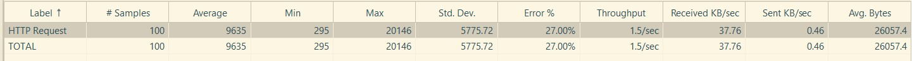
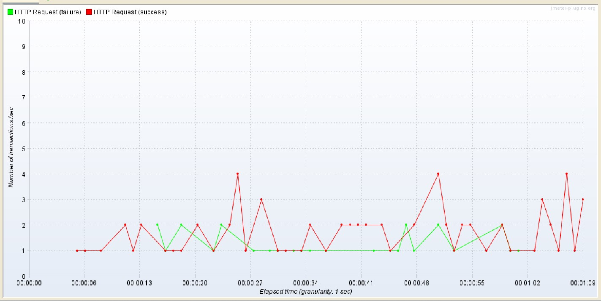

## Pruebas pichincha

### Gestión de la calidad

La solucion del primer y segundo punto se encuentra en:

[Solucion primero punto](./src/test/resources/features/GestionCalidad.feature)

Solución del tercer punto. Los bugs encontrados durante la prueba exploratoria los puedes encontrar en la primer hoja 
llamada **Pruebas Exploratorias** del siguiente documento

[Resultados prueba exploratoria](./PruebaPichincha.xlsx)

### Automatizacion E2E

Solucion puntos 4 y 5

Este proyecto de Java creado con Gradle contiene la automatización, se debe tener en cuenta:

* Contar con gradle instalado, preferiblemente Gradle 7.0
* Tener instalado el JDK, preferiblemente el JDK 8
* Tener instalado Chrome en una maquina Windows, debido que el chromedriver existente es para SO Windows, sino, puedes
descargar el chromedriver segun su SO [aquí](https://chromedriver.chromium.org/downloads) teniendo en cuenta la versión 
de chrome con que se encuentra instalada en su equipo, y dejarla en el directorio raiz de este proyecto

Ejecutar los siguientes pasos para ejecutar la prueba que ejecuta un flujo E2E de una compra de 2 articulos en la tienda

1. Descargar el proyecto, puede usar GIT desde la consola de comandos (previamente debe tener GIT instalado en su maquina)
```
git clone https://github.com/jesuslgarciah/testPichincha.git
```
2. Usar Intellij Idea IDE
2. Dirigirse al [runner](./src/test/java/com/pichincha/automation/runners/TestRunner.java)
3. Ejecutar la clase **TestRunner** mediante el IDE 

### Pruebas API REST
Solucion de los puntos 6 y 7

Desde el postman se puede importar la coleccion de postman, es el archivo [JSON](./Pichincha%20Test.postman_collection.json)
En ella se encuentran las variables y pruebas que se ejecutan una vez se ejecute la colección

En el archivo excel [Resultados prueba exploratoria](./PruebaPichincha.xlsx) en la hoja **Pruebas API** se encuentra el
detalle de lo solicitado en el punto 6 y 7

El caso fallido solicitado en el punto 7 no pudo ser generado debido a que el API siempre retorna la misma respuesta,
cambiando incluso el body del request

### Pruebas de Carga y Stress
Solucion del punto 8

El archivo de JMeter con la solucion del punto 8 se puede encontrar [aquí](./Pichincha.jmx)

#### Analisis de las pruebas



El resultado de la prueba dice que la cantidad de transacciones por segundo ejecutadas es de 1.5

Asi mismo, se presenta una taza de error del 27%, el error que devuelve es un estado 508 Loop Detected, lo que indica
que el servidor finaliza una operacion debido a que encontro un bucle infinito mientras procesaba la solicitud

En la siguiente imagen se puede ver el comportamiento de las transacciones ejecutadas correctamente y los fallos presentados



